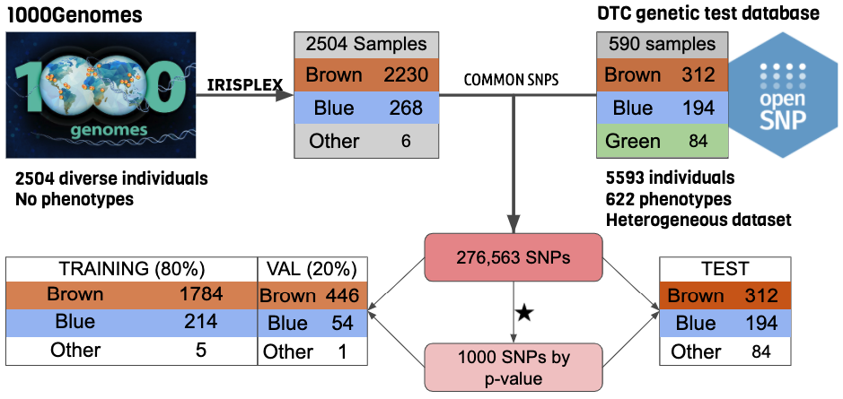

# STR Crazy CSE 284 Final Project
## Prediction of eye color using a feedforward neural network

### Requirements

```bash
conda install --file config/requirements.txt --yes
```

### Repository set-up

 - bin: all scripts and code to train/test models and produce figures
 - config: requirements.txt for setting up environment and csvs for hyperparameter searching
 - data: houses train, val, and test labels and data for training (not uploaded to github)
 - doc: presentation materials
 - models: houses models saved from training, only best models uploaded
 - results: saves `stats` (loss/acc vectors), `plots` (loss/acc) and hyperparameter `search` results

## Training and testing models yourself

### Data download

#### openSNP
wget https://opensnp.org/data/zip/opensnp_datadump.current.zip

#### oneKGenomes
ftp://ftp.1000genomes.ebi.ac.uk/vol1/ftp/release/20130502/

### Data preprocessing
The data preprocessing workflow follows the schematic below


     
In order to preprocess the dataset to be compatible with the model, run the
preprocessing scripts in the following order:

1. initialPhenotypes.py -- get openSNP phenotypes
2. extractGenotypes.py -- get openSNP genotypes from individuals with phenotypes
3. filterGenotypes.py -- filter out low-coverage SNPs
4. oneK_genotypes.sh -- use SNP set from above to pull SNPs from 1000Genomes
5. alleleToNum.py -- use SNP set from 1000Genomes to  extract and convert SNPs in openSNP to 0,1,2
6. extractTestSet.py -- Z-score SNPs in test set and save data and labels as pickle objects
7. extractTrainSet.py -- Z-score SNPs in test set and split into train and val label data (pickles)
8. oneKphenotypes.sh -- get the IrisPlex genotypes from 1000Genomes individuals
9. predictPhenotype.py -- predict phenotypes for 1000Genomes individuals

### Model training
Follow the steps in `Training.ipynb` notebook to train a single model, or perform a hyper parameter
search over many model architectures

### Model testing
First get IrisPlex performance of openSNP by running `testIris.py` script
Then ollow the steps in `Training.ipynb` notebook to test models trained above
